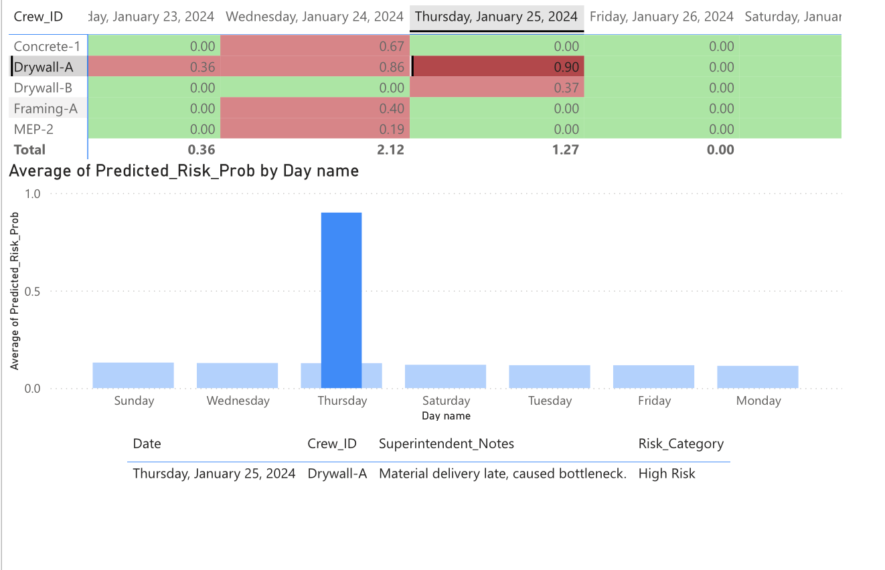

# DPR-Site-Pulse-Predictive-Risk-Engine-for-Construction

*> A predictive analytics dashboard that quantifies the "Human Factor" in construction safety and schedule risk.*

---

## 🚀 Executive Summary
Construction projects often suffer from "Death by a Thousand Cuts"—small, unreported frustrations that accumulate into major safety incidents or schedule slips. Traditional reporting (Budget vs. Actual) is reactive, telling us what went wrong *after* the fact.

**The Solution:**
"Site Pulse" is a predictive analytics engine that quantifies these hidden risks. By integrating structured labor data with **unstructured Superintendent logs**, this tool predicts critical risk days *before* they happen.

### **Business Value**
* **Safety Pre-emption:** Identifies "High Risk" days by correlating crew fatigue (Rolling Overtime) with sentiment decay.
* **Digitized Instinct:** Converts qualitative field notes (e.g., "Crew is confused by drawings") into quantitative risk scores (Risk Probability: 85%).
* **Actionable Insight:** Moves managers from reactive "Firefighting" to proactive "Risk Mitigation."

---

## 📊 Key Insights & Features
**1. The "Risk Heatmap"**
* **Visual:** Matrix of Crews vs. Days.
* **Insight:** Instantly flags high-risk crews using Red/Yellow/Green indicators based on Random Forest probability scores.
* **Impact:** Allows Superintendents to allocate extra supervision to specific crews *before* the shift starts.

**2. The "Monday Effect" Analysis**
* **Discovery:** Sentiment analysis revealed that **Mondays** carry high risk due to "Confusion/Communication" issues, whereas **Fridays** are driven by "Fatigue."
* **Action:** Tailored safety talks: "Plan of the Day" focus on Mondays vs. "Stretch & Flex" focus on Fridays.

**3. Root Cause "Context" Filter**
* **Feature:** Interactive filtering connecting Risk Scores to raw Field Notes.
* **Function:** Clicking a high-risk day instantly reveals the specific logs (e.g., "Waiting on RFI", "Rain delay") driving the score.

---

## 🛠️ Technical Architecture
This project demonstrates an end-to-end data pipeline:

* **Data Engineering (Python/Pandas):**
    * Synthesized realistic Daily Construction Reports (DCRs) and Labor Logs.
    * Engineered features: `Rolling_Overtime_7d`, `Productivity_Rate`, and `Day_of_Week`.
* **Natural Language Processing (NLTK/VADER):**
    * Performed Sentiment Analysis on unstructured Superintendent notes to extract a `Sentiment_Score`.
* **Machine Learning (Scikit-Learn):**
    * Trained a **Random Forest Classifier** to predict `Risk_Event` (Safety Incident or Rework).
    * Achieved probability scoring (`Predicted_Risk_Prob`) to rank daily risk.
* **Visualization (Power BI):**
    * Built an interactive dashboard for non-technical stakeholders.

---

## 📂 Project Structure
* `data/`: Contains the raw and scored datasets.
* `notebooks/`: Python scripts for data generation and model training.
* `dashboard/`: Power BI file and high-res screenshots.

---
